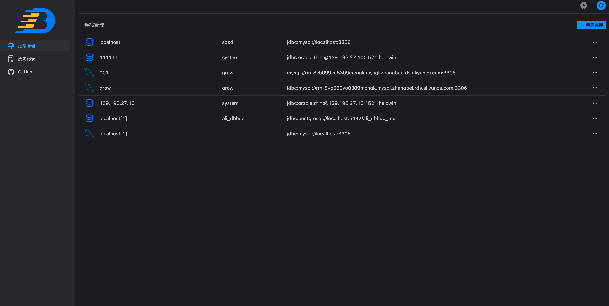
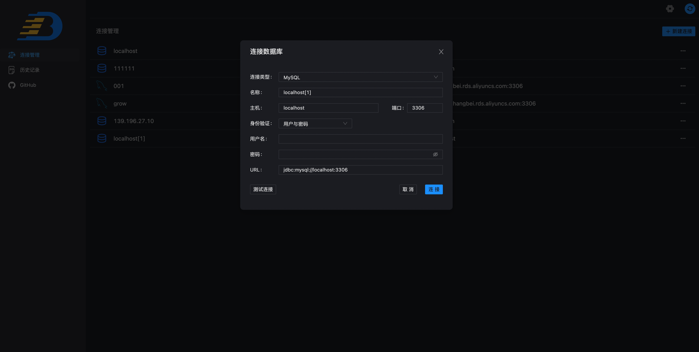
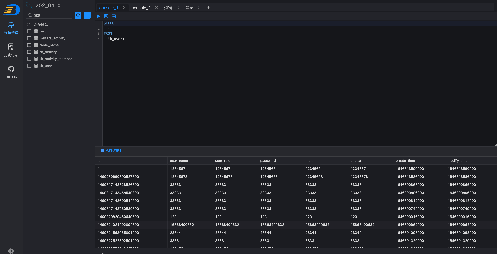
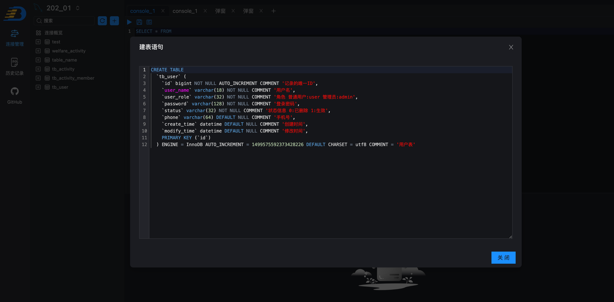

# AliDBHub

##### 语言： 中文 | [English](README_EN.md)
AliDBHub 是面向开发人员的免费多平台数据库工具。多种数据库一个工具。它用于查询、创建和管理数据库，数据库可以在本地、服务器或云端。支持 MySQL、PostgreSQL、Microsoft SQL Server、Oracle、H2等，未来我们会不断完善其他非关系型数据的支持，如Redis。

## Demo演示

## 下载安装

Mac、Windows客户端应用下载地址 <a href="https://github.com/alibaba/ali-dbhub/releases">GitHub releases</a>.

网页版本待更新...
## 运行环境

客户端可以根据操作系统自行选择安装。

注意：
如果需要本地调试

1: java运行 <a href="https://adoptopenjdk.net/" target="_blank">Open JDK 17</a> Node运行环境Node16 <a href="https://nodejs.org/" target="_blank">Node.js</a>.
2: jre参考打包发布中jre安装方式.
## 文档

* <a href="https://github.com/alibaba/ali-dbhub/wiki">WIKI</a>
* <a href="https://github.com/alibaba/ali-dbhub/issues">Issue tracker</a>

## 联系我们
钉钉群：9135032392

## 贡献者

